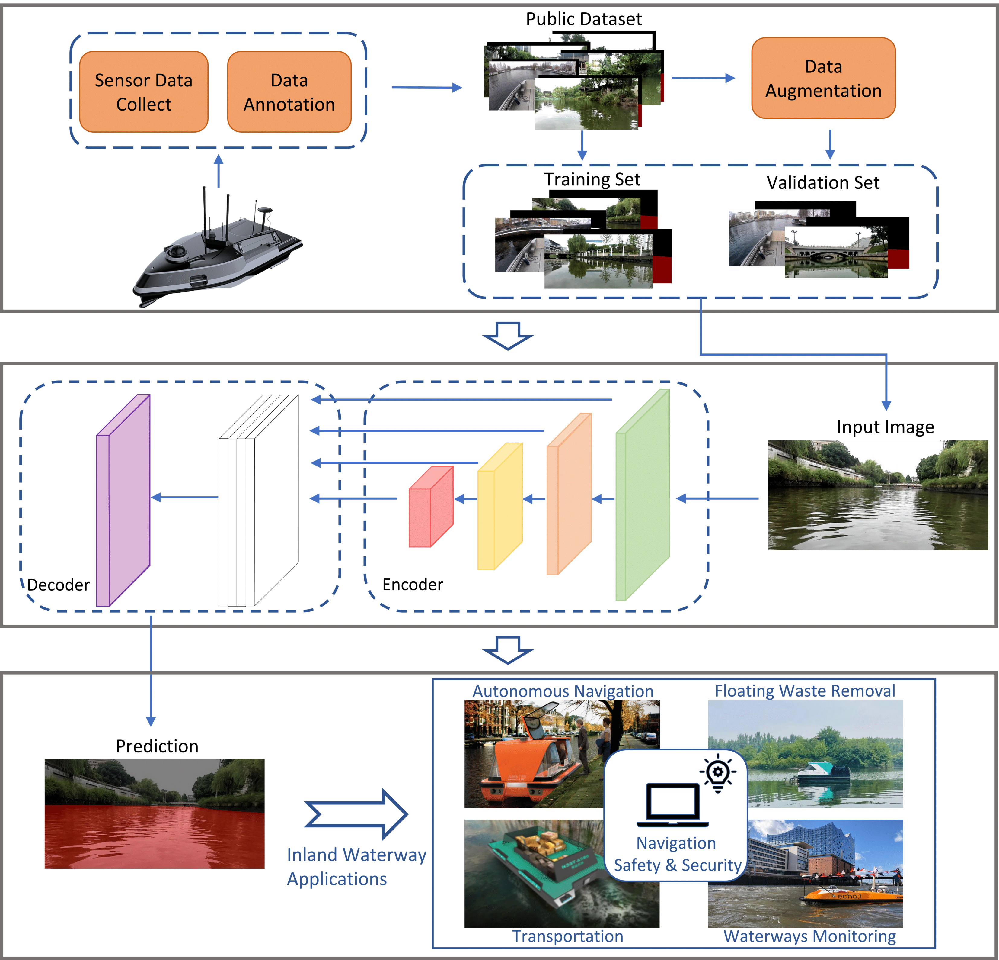

# TBiSeg: A Transformer-based Network with Bi-Level Routing Attention for Inland Waterway Segmentation

Implementation for TBiSeg

## Summary

- Unmanned surface vehicles (USVs) for inland waterways have recently attracted increasing attention in various fields. Accurate detection in navigable regions is crucial for ensuring USV safety in autonomous navigation. However, the complex and variable environment of inland waterways, such as confusable textures and irregular edge details, continues to pose some problems in existing methods. Therefore, to acquire navigable regions, this study proposed TBiSeg, a Vision Transformer-based efficient inland waterway segmentation network, for obtaining pixel-level results. Bi-level routing attention is used to improve the Transformer block, which enhances the understanding of inland water textures. Additionly, this study combined global and local attention through a hierarchical encoder–decoder architecture. To simulate inland waterway scenes as accurately as possible, this study used two representative public datasets for data integration and data augmentation, and conducted testing and cross-validating using multiple inland waterway datasets. Results demonstrated that the model performed better than current state-of-the-art models in segmentation accuracy and robustness in complex inland waterway environments while showing impressive generalization.
  
- The code has been released. It is based on mmsegmentation. Core code is in mmseg/model/backbones/TBiSeg.py
  
## Implementation

The code is implemented based on mmsegmentation.

Please read the official documentation in detail before you run the code.
- [MMSegmentation](https://github.com/open-mmlab/mmsegmentation)

## Dataset

The dataset used in this project is available at:

- [USVInland-Water-Segmentation](https://www.orca-tech.cn/datasets)
- [Tampere-WaterSeg](https://etsin.fairdata.fi/dataset/e0c6ef65-6e1e-4739-abe3-0455697df5ab)
- [Dasha River](https://ieee-dataport.org/documents/dasha-river-dataset)
  

